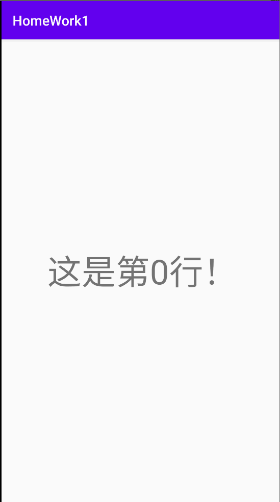

# CS175-Repository

This is a repo for Lesson CS175 "Android-Applications-Development" in SJTU

## Features

1. It has a search box that filters the corresponding content.

2. Click the corresponding content to jump to another page.

3. Set a different icon for this app.

### Screenshot

