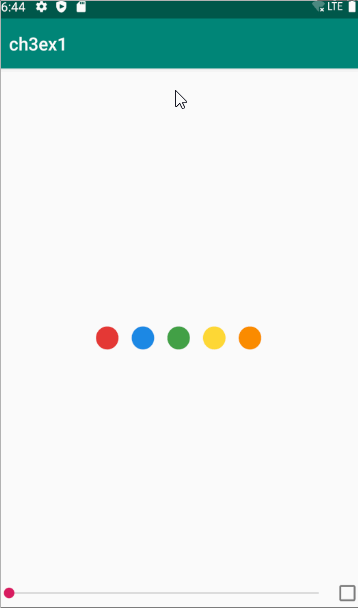
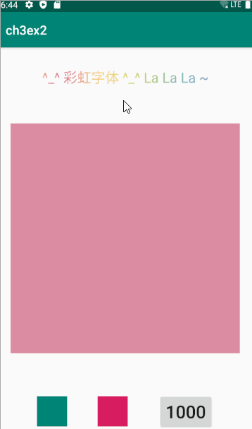
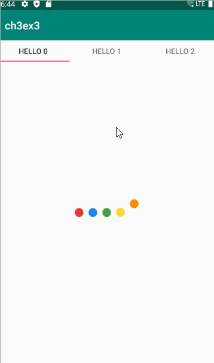

# Homework 3

## Ex1

1. 引⼊ `Lottie` 库实现简单的图标动画
2. 在` activity_main.xml `中添加` LottieAnimationView`
3. 在 `SeekBar` 的回调中修改` LottieAnimationView `的进度

## Ex2

1. 使⽤属性动画，练习`AnimatorSet` 和` scale/fade `等基本动画样式
   - 添加 `scale` 动画
   - 添加 `alpha` 动画
   - 组合到 `AnimatorSet `中

2. 实现彩虹字

## Ex3

   使⽤ `ViewPager` 和 `Fragment` 做⼀个简单的好友列表界⾯
1. 使⽤ `ViewPager` 和 `Fragment` 做可滑动界⾯
2. 使⽤ `TabLayout` 添加 `Tab` ⽀持
3. 对于好友列表 `Fragment`，使⽤ `Lottie` 实现 `Loading `效果，5s后展示实际列
表，要求这⾥的动效是淡⼊淡出

